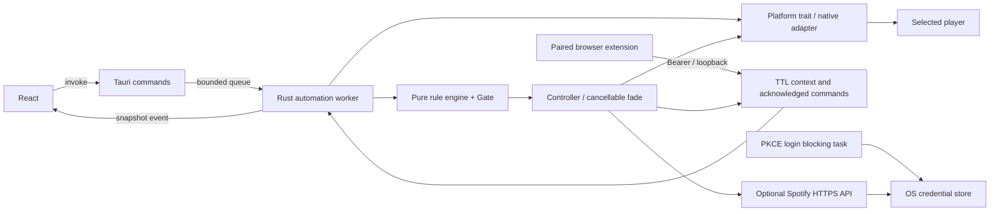

# Mimari kararlar

## Uygulanan fazlar

1. Tauri kabuğu, React arayüzü, minimal capabilities/CSP ve tray yaşam döngüsü.
2. `Platform` trait'i ve işletim sistemine göre derlenen yerel adaptörler.
3. Saf kural motoru, kesici önceliği ve pencere değişimi dengelemesi.
4. Seri medya kontrolü, ses geçişleri, manuel müdahale ve iptal/geri yükleme.
5. Atomik ayarlar, izin akışı, localhost tarayıcı eşleştirmesi.
6. PKCE ile isteğe bağlı Spotify Web API ve işletim sistemi kimlik depoları.
7. Birim/uçtan uca testler ve üç işletim sistemi için paketleme CI'si.

## Veri akışı

COM, D-Bus ve AX erişimi tek iş parçacığında oluşturulup kullanılır. React komutları yerel platform handle'ları almaz. Giriş/çıkış işlemleri sırasında paylaşılan snapshot kilidi tutulmaz. Normal IPC kuyruğu 32 komutla sınırlıdır. Worker yeni ayar/manual komutta atomic generation değerini kontrol ederek eski fade'i durdurur; orijinal ses seviyesini geri yükler. Exit isteği, worker fade temizliğini bitirince tamamlanır.

Algılama aralığı 750–10000 ms, varsayılan 1500 ms'dir. Aktif olmayan otomasyon normalde sensör taramaz; 10 saniyelik düşük frekanslı durum kontrolü yapar. Kullanıcının Yenile/ayar işlemi bir oynatıcı taraması isteyebilir. JXA tarayıcı URL'si en fazla üç saniye önbelleğe alınır; başlık veya uygulama değişimi önbelleği geçersiz kılar. Web API snapshot'ları üç saniye önbelleğe alınır. Bu sürüm event-driven native focus hook'ları yerine sınırlı polling kullanır; fiziksel cihaz performansı ölçülmeden sabit CPU/RAM değeri vaat edilmez.

## Kural semantiği

- `enabled=false` → Hold, hiçbir otonom medya komutu yok.
- Diğer medya ve sabit video kesicileri → Pause. YouTube Music'in kendi `/watch` adresi video kesicisinin dışında tutulur.
- Kullanıcı Pause kuralları, tüm Play kurallarından önce gelir.
- Aynı eylem kategorisinde büyük `priority`, eşitlikte küçük kural ID'si kazanır.
- Domain eşleşmesi parse edilmiş host üzerinde tam alan adı/subdomain sınırıyla yapılır. `youtube.com.evil` eşleşmez.
- App eşleşmesi case-insensitive tam ad/ID üzerinden; Apps eşleşmesi seçili uygulamalardan herhangi birinin kimliği veya platform alias’ı üzerinden; Title açıkça contains semantiğiyle; FileExtension belge yolu veya başlık üzerinden çalışır.
- Pause kararı debounce beklemez; yine de sensör örnekleme ve o anda süren OS çağrısının gecikmesine tabidir.
- Play/Hold kararları `Instant` üzerinden `settleMs` kadar sabit kalmalıdır. Böylece saat değişimi veya hızlı Cmd/Alt-Tab listeyi sıfırlamaz.
- Hold mevcut müziğe dokunmaz. Bir video kesicisinden çıktıktan sonra yalnızca eşleşen Play kuralı varsa devam edilir.
- Kullanıcının duraklatması aynı bağlamda yeniden çalınmaz. Yeni bağlam veya **Otomasyona dön** bunu sıfırlar. Kesici devam ederken kullanıcı yeniden çalarsa kesici tekrar duraklatır.
- Playlist URI'si değişmediyse kesinti sonrası `play` çağrısı mevcut parçayı devam ettirir; tekrar `OpenUri` yapılmaz.
- Oynatıcı kaybolup geri geldiğinde gate sıfırlanır. Hatalı eylemler on saniye sonra yeniden denenir; Spotify 429 ayrıca kendi `Retry-After` süresini uygular.

## IPC sözleşmesi

| Komut                | Girdi                                                               | Çıktı                                                 |
| -------------------- | ------------------------------------------------------------------- | ----------------------------------------------------- |
| `get_snapshot`       | —                                                                   | `Snapshot { settings, status, permissions, players }` |
| `save_settings`      | `{ settings: Settings }`                                            | Doğrulanıp atomik kaydedilmiş `Settings`              |
| `request_permission` | `{ kind: "accessibility" \| "automation" \| "settings" }`           | `Permissions`                                         |
| `media_action`       | `{ action: "play" \| "pause" \| "mediaKey" \| "resumeAutomation" }` | `void`                                                |
| `refresh_status`     | —                                                                   | `void`; worker taraması istenir                       |
| `get_pairing_token`  | —                                                                   | Yerel tarayıcı eşleştirme anahtarı                    |
| `spotify_connect`    | `{ disconnect: boolean }`                                           | Sistem tarayıcısında OAuth veya yerel kimliği silme   |

`deskody://status` olayı `Snapshot` yayınlar. React StrictMode ve unmount sırasında dinleyici kaldırılır. Form taslağı canlı olaylarla ezilmez. Event payload'ı kendi sunucusundan uzaktan bir sayfaya gönderilmez; Tauri yalnızca paketlenmiş frontend'i yükler. Shell/fs/opener gibi genel frontend eklenti yetkileri verilmemiştir. Rust command'ları kullanıcı girdisini ayrıca doğrular; yalnızca capabilities dosyasına güvenilmez.

## Güvenlik ve arıza davranışı

JXA script'leri sabittir; uygulama/playlist verileri argv olarak geçer. Spotify URI'si yalnızca `spotify:playlist|album:<22 alphanumeric>` veya `https://open.spotify.com/...` olabilir. YouTube Music hedefleri `https://music.youtube.com/watch` ve `/playlist` ile sınırlıdır; `v`, `list`, `start_radio`, `index`, `params` doğrulanıp korunur. Frontend ve eklenti `media-target.js` doğrulayıcısını paylaşır; Rust aynı JSON test vektörlerini kullanır. Bağlam URL'sinin gizlilik temizliği, kullanıcının girdiği oynatma hedefinden ayrıdır. `sh -c` kullanılmaz. macOS/Sway/Hyprland yardımcı süreçlerinin süre/çıktı sınırı vardır ve child process'ler reap edilir. Windows UIAutomation çağrıları üçüncü taraf erişilebilirlik sağlayıcılarına bağlıdır; bu senkron çağrılar için mutlak duvar saati garantisi yoktur. D-Bus metodları iki saniyede zaman aşımına uğrar.

Bir medya geçişi uygulama sesini azaltır, eylemi yapar ve geri yükler. Hata/normal iptal durumunda da restore denenir. Oynatıcı bu sırada kapanırsa veya OS süreci zorla öldürürse restore garantisi verilemez. Web API/tarayıcı adımları sınırlandırılmıştır; bunların gecikmesi yüksek hassasiyetli ses DSP fade'i değildir. Sistem ana sesini değiştirmek özellikle önlenmiştir.

Token yenileme ve logout aynı kimlik kilidini paylaşır; eşzamanlı yenileme silinmiş bir oturumu tekrar depoya yazamaz. OAuth callback yalnızca loopback IP, doğru path ve eşleşen state kabul eder. Callback kodu ve token yanıtı loglanmaz. HTTP hata mesajları token/body içeriğini kullanıcı etkinliğine taşımaz.

İzin reddi, kilitli keyring, kaybolan Spotify cihazı, desteklenmeyen compositor veya port çakışması görünür bir hata/yetenek olarak sunulur. Desteklenmeyen bir ortam için sahte aktif pencere ya da sahte müzik durumu üretilmez.

## Kaynaklar

- [Tauri IPC](https://v2.tauri.app/concept/inter-process-communication/)
- [Tauri capabilities](https://v2.tauri.app/security/capabilities/)
- [Windows GSMTC](https://microsoft.github.io/windows-docs-rs/doc/windows/Media/Control/struct.GlobalSystemMediaTransportControlsSession.html)
- [MPRIS Player specification](https://specifications.freedesktop.org/mpris/latest/Player_Interface.html)
- [CoreAudio output process property](https://developer.apple.com/documentation/coreaudio/kaudioprocesspropertyisrunningoutput)
- [Spotify PKCE](https://developer.spotify.com/documentation/web-api/tutorials/code-pkce-flow)

## YouTube Music hedef protokolü (0.1.4)

`BrowserContext.musicPresent` sekme varlığını, `musicCanOpen` sayfa köprüsünü, `musicTransition` yerel geçiş desteğini bildirir. Eski bağlamlar deserialize edilirken yeni yetenek false varsayılır. `WithBrowser::transition`, otomasyonda yalnızca 0.1.4 eklentisine `BrowserCommand { id, action: "transition", url?, volume, fadeMs, pause }` gönderir; eski eklenti görünür güncelleme hatası alır. `Platform::transition` varsayılan olarak None döndürür; diğer sağlayıcıların mevcut fade yolu korunur. Uzak işlem başarılı veya hatalı biterse Rust ikinci bir fade/play/pause uygulamaz.

Ses ve mute başlangıç değeri doğrudan sayfadan, değişiklik yapılmadan önce alınır. Eklenti tek bir async işlemde fade-out, SPA yönlendirme, fade-in ve oynatma kontrolünü yürütür; yükleme sırasında ses sıfırda tutulmaz. Başarı, hata ve iptal çıkışında restore denenir. Mute, ses düzeyinden ayrı tutulur; kullanıcının bilinçli mute/0 ayarı değiştirilmez. Sekme `muted` durumu yeni geçişlerde değiştirilmez. Eski 0.1.3 oturumundan kalan `pendingOpen.wasMuted` sadece kurtarma sırasında geri yüklenir.

MAIN-world adaptörü `#movie_player` içindeki medya elementine öncelik verir. Video kimliği `getVideoData` veya `getPlayerResponse` üzerinden okunur; yöntemlerden biri hata verse de diğeri denenir. Bilinen kimlik hedefle eşleşmelidir. Kimlik API'leri yoksa URL'deki video kimliğine ek olarak yeni medya elementi/yükleme olayı aranır. Her durumda doğru medyada ilerleyen `currentTime` gereklidir; salt URL eşitliği veya `play()` çağrısı başarı sayılmaz. YTM'nin liste parametrelerini değiştirmesi onayı bozmaz. Playlist sayfasında istenen `list` kimliğiyle bir `watch` bağlantısı bulunup SPA üzerinden açılır.

MV3 worker, işlem sırasında bağlam heartbeat'lerini gönderir. Aynı komut kimliği content script ve oturum deposuyla yinelenmez. Rust en fazla 16 saniye bekler; lease 18 saniyedir. Eklentinin yükleme/oynatma bütçesi 11 saniye, ardından bounded restore vardır; tarayıcı sayfa askıya alma gecikmesi bu hedef süreleri aşabilir. Yeni komut/iptal, ayrı cancel mesajıyla önceki işlemde pause/restore yapar; yeni işlem temizliği bekler. Gözlem zaman aşımı kendiliğinden pause göndermez. Zaman aşımı hata mesajı aşama, oynatıcı durumu, readyState, ses ve mute bilgisini içerir; eşleştirme anahtarı veya medya URL'si içermez.

Worker yeniden başladığında bekleyen işlem iptal edilir, kaydedilen ses/mute geri yüklenir ve komut hata ile onaylanır. Sayfa kapanmışsa veya süreç zorla sonlandırılmışsa kurtarma garanti edilemez. Bu entegrasyon YTM'nin belgelenmemiş SPA/oynatıcı detaylarına bağlıdır; canlı hesap ve PWA kabul testi ayrıca gereklidir. `Action::Play.playlist` alanı geriye uyumluluk için korunur; motor yalnızca seçili kaynağa ait bağlantıyı geçirir.

### Eklenti 0.1.3: ayrılma uyarısı ve odak düzeltmesi

`tabs.update({url})` kaldırıldı. `music.js` izole dünyadan sınırlı JSON DOM olaylarıyla `music-page.js` MAIN-world adaptörüne erişir. Yalnızca doğrulanmış YouTube Music watch/browse endpoint'i, sınırlı medya kontrol komutları ve oynatıcı durumu bu sınırdan geçer; token, Chrome API veya keyfi script yürütme geçmez. Adaptör `ytmusic-app` üzerinde `yt-navigate` gönderir ve işlem kimliği/hedef çiftiyle tekrarları engeller. Playlist → ilk şarkı geçişi de aynı yolu kullanır. MAIN-world script manifestte sadece music.youtube.com için bildirilir; ek scripting/host izni gerekmez.

Tam sayfa navigasyonu, link tıklama, beforeunload dinleyicisi silme ve sekme/pencere aktivasyonu yapılmaz. Yönlendirici bulunamazsa hata döner; reload/URL atama fallback'i yoktur. Kullanıcının kendi sayfadan ayrılma koruması çalışmaya devam eder.

- [Chrome content script dünyaları](https://developer.chrome.com/docs/extensions/develop/concepts/content-scripts)
- [YouTube Music oynatıcı API'sini kullanan Pear Desktop renderer](https://github.com/pear-devs/pear-desktop/blob/master/src/renderer.ts)

## Uygulama kataloğu ve Apps eşleştiricisi (0.1.5)

`list_applications` IPC komutu `spawn_blocking` üzerinde `applications::list()` çağırır; otomasyon iş parçacığı ve status polling’i katalog taramaz. Sonuç `InstalledApplication { id, name, aliases }[]`; ada göre sıralanır, kimliğe göre yinelenen kayıtlar ayıklanır. Sabit kökler, sınırlı derinlik/dosya bütçesi ve metadata boyutu kullanılır. macOS bundle içerikleri taranmaz; sadece Info.plist okunur ve LSBackgroundOnly uygulamaları ayıklanır. Liste hiçbir uygulamayı başlatmaz.

`Matcher::App(String)` eski dosyalar için korunur. Yeni `Matcher::Apps(Vec<InstalledApplication>)` OR semantiğine sahiptir. Windows executable yolları context.appId ile tam karşılaştırılır; bundle/desktop kimlikleri ve StartupWMClass alias’ları mevcut sensör kimlikleriyle karşılaştırılır. Adlar arayüz/içe-dışa aktarma içindir. Boş, yinelenen, 64’ten uzun ve kontrol karakterli seçimler frontend ve Rust tarafından reddedilir. Seçilen grupta aynı kural ID’si/playlist korunur; Controller bir sonraki uygulamaya geçişi yeni playlist olarak değerlendirmez.

Arayüz arama, native checkbox klavye davranışı, seçili etiketleri, yükleniyor/hata/boş sonuç ve yenile durumlarını içerir. Eski elle girilmiş adlar katalogda bulunursa kullanıcı seçimi değiştirdiğinde sabit kimliğe çevrilir. Katalogda bulunamayan kayıtlar korunur. Web önizlemesi kurulu uygulama taramış gibi davranmaz; liste gerçek masaüstü IPC’sinde mevcuttur. UI testleri bu sınırda açıkça tanımlı katalog fixture’ı kullanır.

## Deskody yeniden adlandırması (0.1.6)

Görünür ürün adı `Deskody`; Cargo package/lib/binary ve npm package adı `deskody`; tarayıcı eklentisi `Deskody Bridge`. Tauri pencere/tray adları, izin metinleri, OAuth dönüş mesajı, HTML başlığı ve kural dışa aktarma dosyası yeni adı kullanır. Frontend sürüm etiketi `package.json` sürümünden okunur. Tauri status olayı iki uçta `deskody://status` olarak güncellendi.

Kullanıcı verisi ve OS izin devamlılığı için bundle kimliği/varsayılan ayar dizini `dev.musicoptimizer.desktop`, Spotify keyring hizmeti ve Firefox eklenti kimliği korunur. Eklenti sayfa olaylarının adları da korunur; açık YouTube Music sayfasında eski content script ile yeni manifest sürümünün birlikte çalışması bozulmaz. `DESKODY_CONFIG_DIR` yeni ortam değişkenidir; eski değişken geriye uyumlu fallback’tir. Self-context filtresi yeni Deskody executable adlarını da dışlar. Web önizlemesi eski ayar anahtarını okuyup sonraki kayıtları yeni anahtara yazar.

## Hızlı kontrol paneli (0.1.7)

macOS pencere barındırma yolu 0.1.8’de aşağıdaki yerel panel uygulamasıyla değiştirilmiştir; bu bölümdeki genel Tauri konumlandırması Windows/Linux için korunur.

`tray-panel`, aynı yerel frontend’in `?panel=tray` girişini kullanan ikinci Tauri webview’ıdır. 380×580 mantıksal piksel, çerçevesiz, görev çubuğundan gizli ve üstte kalan pencere olarak başlar; varsayılan görünürlüğü kapalıdır. Tray dikdörtgeni fiziksel koordinata dönüştürülür; panel ilgili monitörün çalışma alanına ve ölçeğine göre boyutlandırılıp sınırlandırılır. Görev çubuğu alttaysa simgenin üstüne, macOS menü çubuğunda altına yerleşir. Linux’ta tray menüsü fallback’i kullanılır. Blur/Escape/ikinci tıklama paneli gizler; blur → tray mouse-up sırasındaki yeniden açılma 250 ms korumasıyla engellenir. İlk kurulum dışında ana pencere başlangıçta gizlidir; ayrı aç düğmesi, single-instance çağrısı veya macOS Reopen ile gösterilir.

`quick_change` sadece `enabled`, tek bir kuralın `enabled` alanı veya native menü için otomasyon tersleme isteğini kabul eder. Mutasyon worker kuyruğunda **o anki** Settings üzerinde uygulanır; kimlik doğrulanır ve atomik dosya kaydı başarılı olunca snapshot yayınlanıp IPC yanıtlanır. Böylece panel, eski bir tam Settings kopyasıyla diğer pencerenin ayarlarını ezmez. Ana pencere gelen anahtar değişikliklerini kirli taslağa ve açık kural editörüne birleştirir; diğer kaydedilmemiş alanları korur. Medya komutları mevcut Controller/Platform yolunu kullanır.

Deskody ön plandayken son dış uygulamanın bağlamı korunur; rekabet eden ses bilgisi güncel örnekten değerlendirilir. İlgisiz kural değişiklikleri Controller sahipliğini sıfırlamaz; etkili karar, sağlayıcı veya otomasyon durumu değiştiğinde sıfırlanır. Paneli açmak/yenilemek mevcut playlist’i yeniden başlatmaz. `close_panel`, `open_main`, `quit_app` dar IPC komutlarıdır; frontend’e genel pencere yönetim izinleri verilmez. İki pencere de yalnızca yerel içerik yükler ve status dinleme yetkisini paylaşır.

## AppKit panel barındırıcısı (0.1.8)

Kök neden: Tao 0.35.3 `set_focus`, `makeKeyAndOrderFront` sonrasında `activateIgnoringOtherApps:YES` çağırır. Tauri’nin normal NSWindow’ını aktive etmek başka uygulamanın tam ekran Space’inden Deskody’nin masaüstüne geçişe yol açabilir. `visibleOnAllWorkspaces` tam ekran uyumluluğunu tek başına sağlamaz.

`native/panel.m` yeni bir `DeskodyQuickPanel : NSPanel` oluşturur. `NSWindowStyleMaskNonactivatingPanel` oluşturulurken verilir; Objective-C class swizzling veya özel WindowServer API kullanılmaz. Ana pencere olamaz, klavye için key olabilir. `CanJoinAllSpaces | FullScreenAuxiliary | Transient | IgnoresCycle`, macOS 13+ üzerinde `CanJoinAllApplications` kullanır; birbiriyle çelişen primary/auxiliary/fullScreenNone bitleri eklenmez. `NSStatusWindowLevel` ve `hidesOnDeactivate = NO` diğer uygulamanın üstünde görünmesini sağlar.

Mevcut Tauri `tray-panel` NSWindow gizli ve kayıtlı kalır. Content view, içindeki WKWebView ile birlikte NSPanel’e taşınır; webview/JS/IPC handler’ları yeniden oluşturulmaz. Bu sayede Tauri komutları, CSP ve pencere yetki kimliği korunur. Main-thread-only C API, macOS `toggle_panel`/`hide_panel` yolunda kullanılır. Webview’den gelen aç/kapat istekleri `run_on_main_thread` ile işlenir. Uygulama kapanırken content view asıl pencereye iade edilir, panel ve izleyiciler temizlenir.

Konumlandırma `NSEvent.mouseLocation` ve `NSScreen.visibleFrame` kullanarak AppKit mantıksal koordinatlarında yapılır; böylece farklı ölçekli monitörler arasında yanlış fiziksel koordinat dönüşümü yapılmaz. Menü çubuğunun altına, ekran sınırlarına sığacak boyutta açılır. Panelin kendisi `makeKeyAndOrderFront` kullanır; NSApplication aktivasyonu yapılmaz. Gerçek WKWebView first responder olur; diğer uygulama frontmost kalır.

Panel görünürken yerel mouse/ESC ve global **yalnızca mouse** izleyicileri kurulur. Global klavye izleme/Accessibility izni istenmez. Dış tıklama, key kaybı, uygulama/Space/ekran değişimi ve uyku paneli gizler. İzleyiciler her gizlemede kaldırılır. 250 ms koruma dış tıklamayla kapanmanın ardından tray mouse-up ile yeniden açılmayı önler. Eşleştirme/medya/kural motoru protokolü değişmez.
